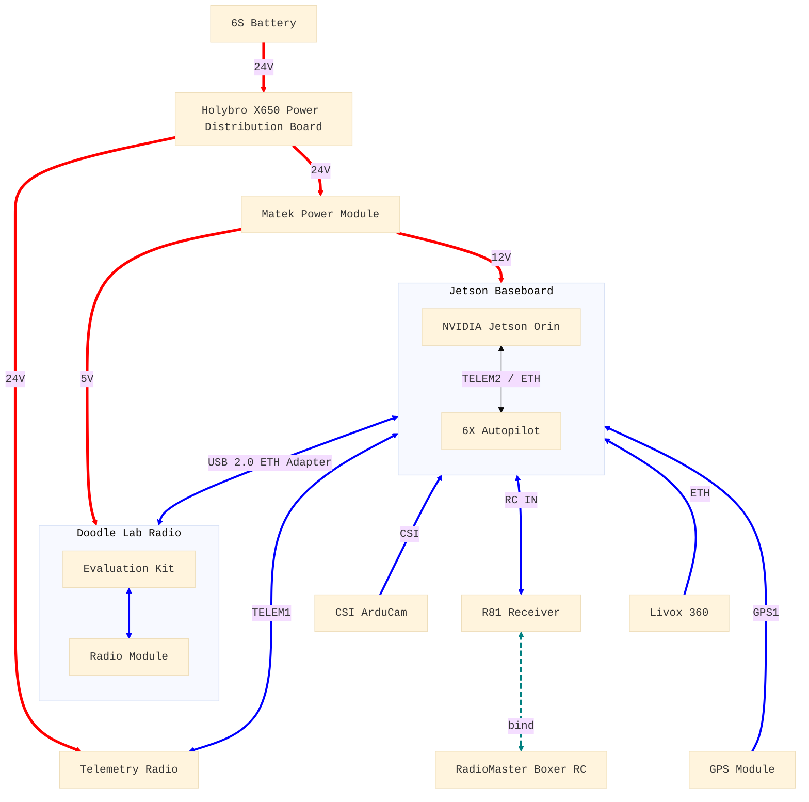

# Bill of Materials

> The following is an example of the hardware components necessary to build a quadcopter supporting **ALL** of `aerial-autonomy-stack`'s capabilities, including perception and multi-robot communication/swarming 

## Example AAS Quadcopter

| #   | Part                                  | Description                                            | Cost (USD) | Link         |
| --: | ------------------------------------- | ------------------------------------------------------ | ---------: | ------------ |
| 1   | Holybro X650 Almost-ready-to-fly Kit  | Quadcopter frame, motors, ESCs, propellers             | 699        | [URL][kit]
| 2   | Holybro H-RTK ZED-F9P Ultralight      | GNSS module (GPS, GLONASS, Galileo, BeiDou)            | 279        | [URL][gps]
| 3   | Holybro Fixed Carbon Fiber GPS mount  | GNSS module support                                    | 12         | [URL][mount]
| 4   | Holybro Microhard Telemetry Radio*    | Point-to-multipoint telemetry (1 ground + 1 per drone) | 449        | [URL][telem]
| 5   | RadioMaster Boxer RC CC2500           | Radio controller                                       | 100        | [URL][rc]
| 6   | RadioMaster R81 V2 Receiver           | Receiver for the radio controller                      | 18         | [URL][rec]
| 7   | Matek Power Module PM12S-4A           | 5V and 12V supply for Doodle and Jetson                | 20         | [URL][matek]
| 8   | Tattu G-Tech 6S 8000mAh 25C 22.2V     | Lipo battery pack with XT60                            | 162        | [URL][batt]
| 9   | Pixhawk Jetson Baseboard Bundle       | Incl. NVIDIA Orin NX 16GB+SSD, Pixhawk 6X, CSI ArduCam | 1450       | [URL][jetson]
| 10  | ASIX AX88772A USB2.0 Ethernet Adapter | 1 for `AIR_SUBNET`, 1 for `SIM_SUBNET` (for HITL only) | 18         | [URL][eth]
| 11  | Doodle Labs RM-2450-11N3              | 2.4GHz Nano radio module (1 ground + 1 per drone)      | 1700       | [URL][doot1]
| 12  | Doodle Labs EK-2450-11N3              | Nano carrier/evaluation kit (1 ground + 1 per drone)   | 290        | [URL][doot2]
| 13  | DJI Livox Mid-360**                   | LiDAR sensor                                           | 749        | [URL][liv]
| 14  | Livox three-wire aviation connector** | Power and ethernet connector for the LiDAR             | 89         | [URL][liv2]

> *For a single drone, one can alternatively use the point-to-point [SiK telemetry radio][telem2] (89)
>
> **LiDAR sensor, optional for a camera-only solution

[kit]:https://holybro.com/collections/x650-kits/products/x650-kits?variant=43994378240189
[gps]:https://holybro.com/collections/standard-h-rtk-series/products/h-rtk-f9p-ultralight?variant=45785783009469
[mount]:https://holybro.com/collections/gps-accessories/products/fixed-carbon-fiber-gps-mount?variant=42749655449789
[telem]:https://holybro.com/collections/telemetry-radios/products/microhard-radio?variant=42522025590973
[telem2]:https://holybro.com/collections/telemetry-radios/products/sik-telemetry-radio-1w?variant=45094904856765
[rc]:https://radiomasterrc.com/collections/boxer-radio/products/boxer-radio-controller-m2?variant=46486352298176
[rec]:https://holybro.com/collections/rc-radio-transmitter-receiver/products/radiomaster-r81-receiver
[matek]:https://www.mateksys.com/?portfolio=pm12s-4a
[batt]:https://genstattu.com/tattu-8000mah-22-2v-25c-6s1p-lipo-battery-pack-with-xt60-plug.html
[jetson]:https://holybro.com/collections/flight-controllers/products/pixhawk-jetson-baseboard?variant=44636223439037
[eth]:https://www.amazon.ca/TRENDnet-TU2-ET100-USB-Mbps-Adapter/dp/B00007IFED/
[liv]:https://store.dji.com/ca/product/livox-mid-360?vid=130851
[liv2]:https://store.dji.com/ca/product/livox-three-wire-aviation-connector?vid=117441
[doot1]:https://www.mouser.ca/ProductDetail/Doodle-Labs/RM-2450-11N3?qs=ulEaXIWI0c91eCn7VRB%2FpA%3D%3D
[doot2]:https://www.mouser.ca/ProductDetail/Doodle-Labs/EK-2450-11N3?qs=ulEaXIWI0c%2FLOqPeL4gNgg%3D%3D
